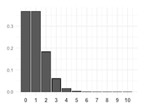
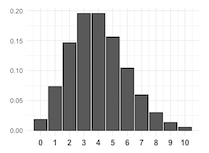
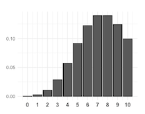

بِسْمِ اللَّهِ الرَّحْمَنِ الرَّحِيمِ
Curated by Alfian

## 📊 Distribution of Amir's sales ##
Instruction 1/2:

    # Histogram of amount with 10 bins and show plo
    amir_deals['amount'].hist(bins = 10)
    plt.show()

Instruction 2/2:
C. Normal

## 📊 Probabilities from the normal distribution ##
Instruction 1/4:

    # Probability of deal < 7500
    prob_less_7500 = norm.cdf(7500, 5000, 2000)

    print(prob_less_7500)

Instruction 2/4:

    # Probability of deal > 1000
    prob_over_1000 = 1 - norm.cdf(1000, 5000, 2000)

    print(prob_over_1000)

Instruction 3/4:

    # Probability of deal between 3000 and 7000
    prob_3000_to_7000 = norm.cdf(7000, 5000, 2000) - norm.cdf(3000, 5000, 2000)

    print(prob_3000_to_7000)

Instruction 4/4:

    # Calculate amount that 25% of deals will be less than
    pct_25 = norm.ppf(0.25, 5000, 2000)

    print(pct_25)

## 📊 Simulating sales under new market conditions ##
    # Calculate new average amount
    new_mean = 5000 * 1.20

    # Calculate new standard deviation
    new_sd = 2000 * 1.30

    # Simulate 36 new sales
    new_sales = norm.rvs(new_mean, new_sd, size = 36)

    # Create histogram and show
    plt.hist(new_sales)
    plt.show()

## 📊 Which market is better? ##
C. Amir performs about equally in both markets.

## 📊 Visualizing sampling distributions ##
E. None of the above

## 📊 The CLT in action ##
Instruction 1/4:

    # Create a histogram of num_users and show
    amir_deals['num_users'].hist()
    plt.show()

Instruction 2/4:

    # Set seed to 104
    np.random.seed(104)

    # Sample 20 num_users with replacement from amir_deals
    samp_20 = amir_deals['num_users'].sample(20, replace = True)

    # Take mean of samp_20
    print(np.mean(samp_20))

Instruction 3/4:

    # Set seed to 104
    np.random.seed(104)

    # Sample 20 num_users with replacement from amir_deals and take mean
    samp_20 = amir_deals['num_users'].sample(20, replace=True)
    np.mean(samp_20)

    sample_means = []
    # Loop 100 times
    for i in range(100):
    # Take sample of 20 num_users
    samp_20 = amir_deals['num_users'].sample(20, replace=True)
    # Calculate mean of samp_20
    samp_20_mean = np.mean(samp_20)
    # Append samp_20_mean to sample_means
    sample_means.append(samp_20_mean)
    
    print(sample_means)

Instruction 4/4:

    # Set seed to 104
    np.random.seed(104)

    sample_means = []
    # Loop 100 times
    for i in range(100):
    # Take sample of 20 num_users
    samp_20 = amir_deals['num_users'].sample(20, replace=True)
    # Calculate mean of samp_20
    samp_20_mean = np.mean(samp_20)
    # Append samp_20_mean to sample_means
    sample_means.append(samp_20_mean)
    
    # Convert to Series and plot histogram
    sample_means_series = pd.Series(sample_means)
    sample_means_series.hist()
    # Show plot
    plt.show()

## 📊 The mean of means ##
    # Set seed to 321
    np.random.seed(321)

    sample_means = []
    # Loop 30 times to take 30 means
    for i in range(30):
    # Take sample of size 20 from num_users col of all_deals with replacement
    cur_sample = all_deals['num_users'].sample(20, replace = True)
    # Take mean of cur_sample
    cur_mean = np.mean(cur_sample)
    # Append cur_mean to sample_means
    sample_means.append(cur_mean)

    # Print mean of sample_means
    print(np.mean(sample_means))

    # Print mean of num_users in amir_deals
    print(np.mean(amir_deals['num_users']))

## 📊 Identifying lambda ##
Lambda = Highest frequency of Y Axis from the respected X Axis, for example Lambda = 1 the distribution will look Right-Skewed since the distribution clumped up around X value of 1.

lambda = 1

lambda = 4

lambda = 8

## 📊 Tracking lead responses ##
Instruction 1/4:

    # Import poisson from scipy.stats
    from scipy.stats import poisson

    # Probability of 5 responses
    prob_5 = poisson.pmf(5, 4)

    print(prob_5)

Instruction 2/4:

    # Import poisson from scipy.stats
    from scipy.stats import poisson

    # Probability of 5 responses
    prob_coworker = poisson.pmf(5, 5.5)

    print(prob_coworker)

Instruction 3/4:

    # Import poisson from scipy.stats
    from scipy.stats import poisson

    # Probability of 2 or fewer responses
    prob_2_or_less = poisson.cdf(2, 4)

    print(prob_2_or_less)

Instruction 4/4:

    # Import poisson from scipy.stats
    from scipy.stats import poisson

    # Probability of > 10 responses
    prob_over_10 = 1 - poisson.cdf(10, 4)

    print(prob_over_10)

## 📊 Distribution dragging and dropping ##
Poisson:
1. Number of products sold each week
2. Number of customers that enter a store each hour

Exponential:
1. Amount of time unitil someone pays off their loan
2. Amount of time until the next customer makes a purchase

Binomial:
1. Number of people from a group of 30 that pass their driving test

## 📊 Modeling time between leads ##
Instruction 1/3:

    # Import expon from scipy.stats
    from scipy.stats import expon

    # Print probability response takes < 1 hour
    print(expon.cdf(1, scale = 2.5))

Instruction 2/3:

    # Import expon from scipy.stats
    from scipy.stats import expon

    # Print probability response takes > 4 hours
    print(1 - expon.cdf(4, scale = 2.5))

Instruction 3/3:

    # Import expon from scipy.stats
    from scipy.stats import expon

    # Print probability response takes 3-4 hours
    print(expon.cdf(4, scale = 2.5) - expon.cdf(3, scale = 2.5))

## 📊 The t-distribution ##
D. The t-distribution is skewed.